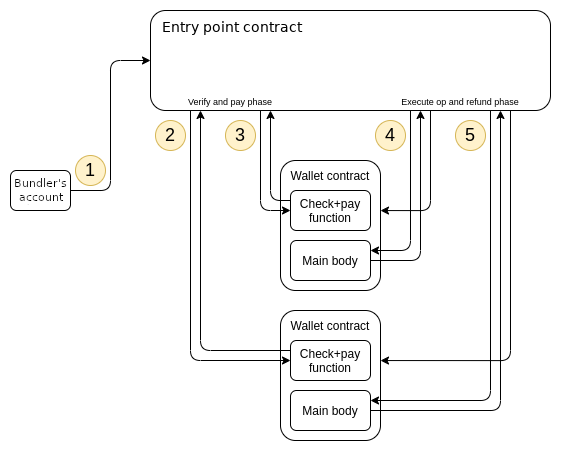
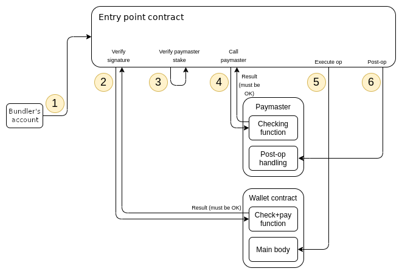

## EIP-4337 Account Abstraction

### 概括
账户抽象核心是将账户的签名权和所有权解耦拆分，为用户提供了在更高层次上使用账户的能力，而无需对底层流程了解过多。
就像使用Gmail账户却不知道它的运行原理一样。有了账户抽象，我们就有机会远离助记词的可怕世界。我们可以启用不同的签名选项，gas费可以由Dapp赞助或通过法币支付，等等。

### 引入Account Abstraction前
目前以太坊上有两种类型的账户：
1. 外部拥有账户(EOA)
2. 智能合约账户
外部自有账户由用户的密钥对(公钥和私钥)控制。这是大多数用户用来与以太坊交互的工具。
智能合约账户不受任何私钥控制，而是由它们的代码控制。

由于早期的设计，以太坊的的账户模型有有着一些缺陷：
EOA账号有以下的限制
1. 用户不能使用自定义签名方案。ECDSA是一种典型的签名方案，以太坊使用它来生成公私钥对。
2. Gas费用必须用原生加密货币(ETH)支付。
3. 因为你的私钥是你的帐户，丢失私钥就意味着丢失帐户。

智能合约账户可以解决上述问题，但是交易只能通过ECDSA保护的外部拥有账户(EOA)启动，而不能通过智能合约钱包
所以提出了Account Abstraction的概念。

### Account Abstraction 概念
`Account Abstraction`没有修改共识层本身的逻辑，而是提议在更高级别的系统中复制当前交易内存池的功能，称为`User Operation Mempool`。该提案引入了`user operations`（用户操作）的概念，这些操作允许我们将自定义功能编码到我们的智能合约钱包。用户操作将用户的意图与签名和其他数据打包起来，以便进行验证。

### Definitions
- `UserOperation` 描述了用户的操作等信息。它由钱包 App 创建并提交给 Bundler
- `Bundler` 用户通过`Bundler`的 RPC `eth_sendUserOperation` 可以提交 `UserOperation` 到 `UserOperation Mempool`中;`Bundler` 调用 `EntryPoint` 合约的 `handleOps` 方法，可以把`UserOperation` 作为 `handleOps` 的参数提交上链
- `EntryPoint`合约 `User Operation`的入口合约，实现了`handleOps`等方法。不需要钱包开发者实现，目前社区已经部署上线了，合约地址
  - old [0x0576a174D229E3cFA37253523E645A78A0C91B57](https://etherscan.io/address/0x0576a174D229E3cFA37253523E645A78A0C91B57)
  - 0.6.0[0x5ff137d4b0fdcd49dca30c7cf57e578a026d2789](https://etherscan.io/address/0x5ff137d4b0fdcd49dca30c7cf57e578a026d2789)
- `Account`合约：钱包开发者需要实现的合约，必须实现 `validateUserOp` （`EntryPoint`合约的 handleOps方法会调用它）来校验 `UserOperation`的合法性。
- `Aggregator` 是一个可选的合约。如果想实现签名聚合，则钱包开发者需要实现它
- `Paymaster` 是一个可选的合约。如果想实现使用其它代币支付 Gas 等功能，则钱包开发者需要实现它






实现的合约仓库
https://github.com/eth-infinitism/account-abstraction/tree/develop/contracts

#### 1.User Operation
```javascript
{
    sender: address, // 用户的 Account 合约地址
    nonce: uint256,  // 防止重放攻击的参数，其含义由 Account 合约定义
    initCode: bytes, // 仅第一次创建 Account 合约时才需要。前 20 字节是 AccountFactory 的地址，从第 21 字节开始是调用 AccountFactory 时的 calldata
    callData: bytes, // 在运行 execution step 时，它是调用用户的 Account 合约时的 calldata
    callGasLimit: uint256, // 运行 execution step 的 gas 上限
    verificationGasLimit: uint256, // 运行 verification step 的 gas 上限
    preVerificationGas: uint256, // 给打包者的gas付费
    maxFeePerGas: uint256, // 每种气体的最高费用（类似于EIP-1559 max_fee_per_gas 参数）
    maxPriorityFeePerGas: uint256 //每种气体的最高优先费（类似于EIP-1559max_priority_fee_per_gas ）
    paymasterAndData: bytes, // Paymaster 合同地址以及验证和执行所需的任何额外数据
    signature: bytes, // signature 字段和 nonce 字段，在运行 verification step 时需要它们。signature 字段的含义由 Account 合约定义
}

用户的 Account 合约不需要提前部署就可以直接得到地址用于收款。这是由于这个合约是 AccountFactory 合约通过 create2 来创建，所以在创建之前就可以确定 Account 合约的地址了。
```

#### 2.Bundler
可以理解成一个rpc节点
- 收听 UserOperation mempool。
- 运行模拟
- 捆绑一组操作
- 将这些bundles提交到EntryPoint合约


#### 3. EntryPoint
EntryPoint 的主要逻辑可分为`Verification Loop`和`Execution Loop`两个大循环.在 `Verification Loop`中会校验每个`User Operation` 的合法性（这个阶段中如果发现 Account 合约还不存在，则会创建 Account 合约);在 Execution Loop 中执行每个 User Operation。
具体的图可见[这里](https://docs.stackup.sh/docs/introduction/erc-4337-overview#entrypoint)

#### 4.Contract Account
Account 合约就是用户的智能合约钱包。应该具备普通 EOA 钱包的所有能力，比如可以给别人转帐，可以调用其它的合约。需要检查在验证循环期间是否接受`UserOperation`,支持其他账户功能的附加功能，如社交恢复和多操作，也可以在这里添加。

必须的接口:
```javascript
function validateUserOp (UserOperation calldata userOp, bytes32 userOpHash, uint256 missingAccountFunds) external returns (uint256 validationData);

a. 验证 `User Operation` 的 signature；
b. 把合约中的 nonce 值加 1；
c. 支付至少`missingAccountFunds`的费用给 msg.sender 充当 Gas。
```

#### 5. Aggregator
实现聚合签名

#### 6. Paymaster
当 User Operation 的 `paymasterAndData` 字段不为空时，表示处理这个 `User Operation` 时使用 `Paymaster`，这样支付给 `Bundler` 的 Gas 不用 `Account` 合约出了,而是由 `Paymaster` 来支付。

在paymaster中的`_postOp`可以构造用户用erc20付款的操作

### EIP-4337的不足
- EIP-4337 钱包无法使用禁止了合约帐户的 DApp
有一些 DApp 只允许 EOA 帐户调用合约，禁止了合约帐户调用合约。DApp合约函数中判断require(tx.origin == msg.sender); 来限制只有 EOA 帐户才能调用合约。这样的 DApp 无法被 EIP-4337 的合约帐户使用。
- EIP-4337钱包无法使用不支持EIP-1271的DApp
如果DApp合约存在使用 EIP-191/EIP-712 标准来验证签名数据的逻辑，这样的DApp只能被EOA帐户使用，不能被合约帐户使用。这是因为合约帐户背后并不存在像EOA帐户那样的私钥，从而合约帐户自己是无法生成 EIP-191/EIP-712所需要的签名数据。为了解决上面问题，EIP-1271 被提出，它的方案是：

  - 1. 智能合约钱包需要实现方法`isValidSignature`。
  - 2. 验证方（即 DApp 合约）如果发现和它交互的帐户是 EOA 地址，则还是按照 EIP-191/EIP-712 标准，通过调用 `ecrecover `来验证签名数据；DApp 若发现和它交互的是一个合约地址，则不调用 `ecrecover` 验证签名，而是通过调用合约帐户的方法`isValidSignature`来验证签名。
显然， EIP-1271 需要 DApp 合约做适配

注：EIP-1271 有一个限制：由于使用 create2 部署的合约可以在部署之前就确定合约地址，这样没有部署的智能合约也能正常收款。“还没有部署的智能合约”显然还不能被 DApp 合约按照 EIP-1271 的方式来验证签名，关于这个问题在 account-abstraction #188 中有记录，它的解决方案 EIP-6492，具体做法是签名时如果智能合约没有部署则在产生的签名数据中还附带其它信息（部署钱包所需要的信息），验证方发现这个特别的签名数据后，先去部署合约，部署完后再进行 EIP-1271 的验证。
